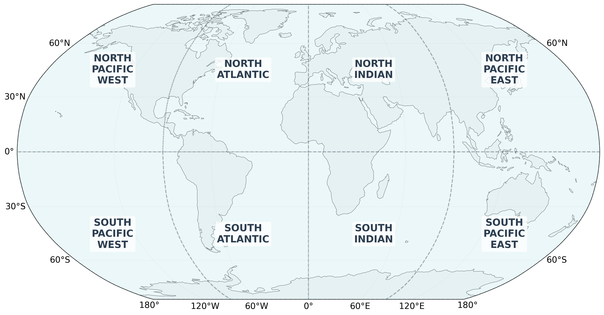

# Dataset Description

OceanTACO is a multi-source oceanographic dataset covering five sea surface variables, organized as regional NetCDF tiles and hosted on HuggingFace.

**HuggingFace dataset:** [nilsleh/OceanTACO](https://huggingface.co/datasets/nilsleh/OceanTACO)

---

## Dataset Versions and Coverage

OceanTACO is released in two temporal versions to support both SWOT-era and longer pre-SWOT analyses.

- **Core version:** `2023-03-29` to `2025-08-01` (includes SWOT calibration and science phases).
- **Extended version:** `2015-01-01` to `2023-03-29` (all modalities except SWOT).
- **Shared boundary date:** both versions meet at `2023-03-29`, which allows seamless concatenation.

Temporal indexing is daily. The core period contains 856 daily indices, and the extended period contains 3009 daily indices.

---

## Processing Levels and Sensor Semantics

OceanTACO combines products with different observational and modeling characteristics:

- **L3 observations:** preserve native or near-native sampling geometry and sparse coverage.
- **L4 products:** gap-filled mapped fields optimized for spatial completeness.
- **Reanalysis (GLORYS):** physically consistent model-assimilated fields.
- **In situ (Argo):** independent profile observations for validation and cross-checking.

These levels are complementary but not interchangeable. Differences in sampling, mapping, and assimilation should be considered when comparing products.

---

## Data Sources

OceanTACO aggregates products from five observational categories:

| Category | Sources | Variables |
|---|---|---|
| **L4 gridded** (fused/interpolated) | DUACS, CMEMS | SSH (SLA), SST, SSS, Wind |
| **L3 along-track** (swath) | DUACS, SMOS, SWOT | SSH, SSS ascending/descending |
| **GLORYS reanalysis** | CMEMS GLORYS12 | SSH, SST, SSS, currents (u/v) |
| **Argo floats** | Argo GDAC | Temperature profiles (point source) |

---

## Variables

The following variables are available in OceanTACO. Use the **token** string when constructing `OceanTACODataset`.

| Token | NetCDF variable | Description | Units |
|---|---|---|---|
| `l4_ssh` | `sla` | L4 Sea Level Anomaly | m |
| `l4_sst` | `analysed_sst` | L4 Sea Surface Temperature (auto-converted to °C on load) | °C |
| `l4_sss` | `sos` | L4 Sea Surface Salinity | PSU |
| `l4_wind` | `eastward_wind` | L4 Eastward Wind | m/s |
| `l3_sst` | `adjusted_sea_surface_temperature` | L3 SST | K |
| `l3_sss_smos_asc` | `Sea_Surface_Salinity` | L3 SMOS SSS (ascending pass) | PSU |
| `l3_sss_smos_desc` | `Sea_Surface_Salinity` | L3 SMOS SSS (descending pass) | PSU |
| `l3_ssh` | `sla_filtered` | L3 along-track SSH | m |
| `l3_swot` | `ssha_filtered` | SWOT SSH anomaly | m |
| `argo` | `TEMP` | Argo float temperature profiles (point source) | °C |
| `glorys_ssh` | `zos` | GLORYS reanalysis SSH | m |
| `glorys_sst` | `thetao` | GLORYS reanalysis SST | °C |
| `glorys_sss` | `so` | GLORYS reanalysis Salinity | PSU |
| `glorys_uo` | `uo` | GLORYS reanalysis eastward current | m/s |
| `glorys_vo` | `vo` | GLORYS reanalysis northward current | m/s |

---

## Ocean Regions

The global ocean is divided into 8 equal 90°×90° tiles. Each region corresponds to one directory in the dataset.

| Region | Longitude | Latitude |
|---|---|---|
| `SOUTH_PACIFIC_WEST` | −180° to −90° | −90° to 0° |
| `SOUTH_ATLANTIC` | −90° to 0° | −90° to 0° |
| `SOUTH_INDIAN` | 0° to 90° | −90° to 0° |
| `SOUTH_PACIFIC_EAST` | 90° to 180° | −90° to 0° |
| `NORTH_PACIFIC_WEST` | −180° to −90° | 0° to 90° |
| `NORTH_ATLANTIC` | −90° to 0° | 0° to 90° |
| `NORTH_INDIAN` | 0° to 90° | 0° to 90° |
| `NORTH_PACIFIC_EAST` | 90° to 180° | 0° to 90° |



---

## Spatial and Temporal Indexing

OceanTACO uses a fixed global indexing model designed for reproducible cross-source querying:

- The ocean is partitioned into 8 fixed regional tiles.
- Data are indexed daily.
- Each sample is queryable by time window, region, data source, and variable token.

Because the internal sample layout is consistent across products and processing levels, the same data-access workflow can be reused across sensors and studies.

---

## Data Format

### Local directory structure

When downloaded locally, OceanTACO follows this layout:

```
DATA/
└── <YYYY_MM_DD>/
    └── <REGION_NAME>/
        ├── l4_ssh.nc
        ├── l4_sst.nc
        ├── l4_sss.nc
        ├── l3_ssh.nc
        ├── l3_swot.nc
        ├── glorys.nc
        └── ...
```

### NetCDF encoding

Files use HDF5/NetCDF4 with scaled `int16` encoding and lossless `zlib` compression. The tile format is compatible with `xarray` and `h5netcdf`. Spatial coordinates follow a regular lat/lon grid; Argo profiles use an unstructured point dimension.

---

## Processing Workflow and Known Limitations

OceanTACO generation follows three high-level steps:

1. Regional tiling of daily global products.
2. Conservative binning/regridding of sparse L3 observations.
3. Storage encoding with scaled `int16` and lossless compression.

Important interpretation caveats:

- **Projection:** data are stored in WGS84 (`EPSG:4326`), which is not area-preserving and introduces stronger distortion toward high latitudes.
- **L3 gridding behavior:** binning preserves observed sampling patterns; additional gap-filling is not introduced at this stage.
- **Uncertainty interpretation:** aggregated per-cell uncertainty primarily reflects within-track variability and may not fully capture between-track sampling differences.
- **Cross-level comparison:** L4 and reanalysis fields include mapping/assimilation effects and should be interpreted accordingly when compared to L3 or in situ observations.

---

## HuggingFace Access

OceanTACO is hosted on HuggingFace and can be accessed without downloading the full dataset.

### Stream via `tacoreader`

```python
from ocean_taco.dataset.retrieve import HF_DEFAULT_URL, load_hf_dataset, load_tile_nc

dataset_hf = load_hf_dataset(HF_DEFAULT_URL) # TACO df

# Load one named-region tile
ds = load_tile_nc(
    dataset_hf,
    date="2024-06-01",
    tile="NORTH_ATLANTIC",
    data_source="l4_sst",
    cache_dir="./cache",   # optional local cache
)
```

### Load all tiles covering a bounding box

```python
from ocean_taco.dataset.retrieve import load_bbox_nc

ds = load_bbox_nc(
    dataset_hf,
    date="2024-06-01",
    bbox=(-80, -30, 25, 50),  # (lon_min, lon_max, lat_min, lat_max)
    data_source="l4_sst",
)
```

### Download full snapshot (huggingface_hub)

```python
from huggingface_hub import snapshot_download

local_dir = snapshot_download(repo_id="nilsleh/OceanTACO", repo_type="dataset")
```
---

## Licenses

- **Code**: Apache 2.0
- **Dataset**: Creative Commons Attribution 4.0 International (CC BY 4.0)

See the [OceanTACO Dataset Card](https://huggingface.co/datasets/nilsleh/OceanTACO) for full license information, required attribution, acknowledgements, and citations.
