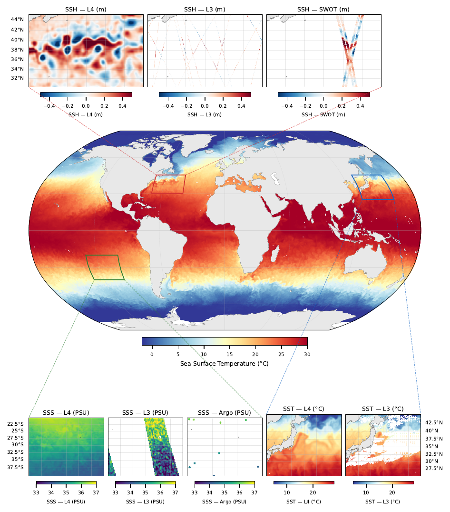

# OceanTACO

**OceanTACO** is a multi-source sea surface variable dataset with cloud-native dataloaders for machine learning workflows.

[](https://huggingface.co/datasets/nilsleh/OceanTACO)
[](https://github.com/nilsleh/oceanTACO/blob/main/LICENSE)
[](https://huggingface.co/datasets/nilsleh/OceanTACO)

---

OceanTACO provides co-located observations of sea surface height (SSH), sea surface temperature (SST), sea surface salinity (SSS), ocean currents, wind, and Argo float profiles — organized as regional NetCDF tiles and hosted on HuggingFace.


**Key features:**

- **Quickstart workflow**: install, query a regional tile, and plot your first map in [Getting Started](getting_started.md)
- **Data access workflow**: browse remote files, subset by region/date, and work cloud-first via [Dataset Workflows](dataset-workflows.md)
- **Machine learning workflow**: build training/evaluation query sets and use `OceanTACODataset` with PyTorch in [Dataset ML Loader](dataset-ml-loader.md)
- **Data generation workflow**: reproduce formatting, tiling, and statistics with the [Dataset Generation Pipeline](dataset_generation.md)
- **Hands-on tutorials**: run complete examples for mapping, coupling, and case studies in [Tutorials](tutorials/index.md)




```{toctree}
:maxdepth: 2
:caption: Contents

getting_started
dataset-workflows
dataset-ml-loader
dataset_description
dataset_generation
tutorials/index
api/index
```
