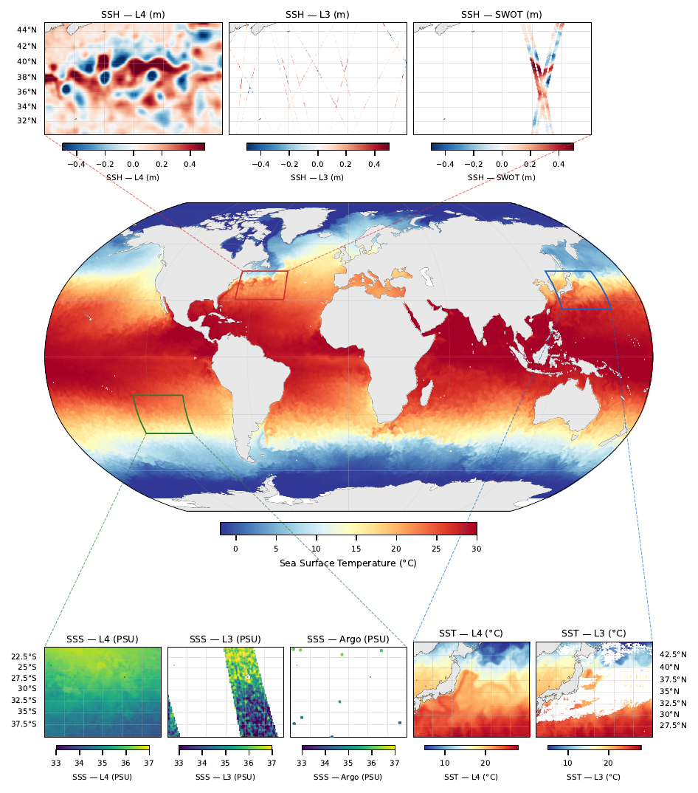

# OceanTACO

**OceanTACO** is a multi-source sea surface variable dataset with cloud-native dataloaders for machine learning workflows.

[](https://huggingface.co/datasets/nilsleh/OceanTACO)
[](https://github.com/nilsleh/oceanTACO/blob/main/LICENSE)
[](https://huggingface.co/datasets/nilsleh/OceanTACO)

---

OceanTACO provides co-located observations of sea surface height (SSH), sea surface temperature (SST), sea surface salinity (SSS), ocean currents, wind, and Argo float profiles — organized as regional NetCDF tiles and hosted on HuggingFace.


**Where to start:**

- **Install and read one subset**: [Getting Started](getting_started.md) installs the package and
  crops a single day of SST in about ten lines.
- **Retrieve and inspect data**: [QuerySet selection and native-coordinate
  retrieval](tutorials/data_retrieval_workflows.ipynb) covers filters, coverage evidence, and the
  `ocean_taco.retrieve` functions, with every cell executed against the pinned catalog.
- **Train a model**: [From a published QuerySet to a rendered
  sample](tutorials/ml_dataset.ipynb) is the entry point for the ML path, and links onward to the
  [renderer reference](tutorials/ml_configuration_cookbook.ipynb) and to [forecasting,
  super-resolution, and the training loader](tutorials/spatio_temporal_query_generation.ipynb).
- **Reproduce the paper figures**: the two Hurricane Milton notebooks in
  [Tutorials](tutorials/index.md) import their figure code from `ocean_taco.figures`.
- **Regenerate the dataset**: the [Dataset Generation Pipeline](dataset_generation.md) documents
  the download, formatting, and TACO-build steps. These use repository tooling that is not part of
  the installed package.




```{toctree}
:maxdepth: 2
:caption: Using OceanTACO

getting_started
tutorials/index
api/index
```

```{toctree}
:maxdepth: 2
:caption: The dataset

dataset_description
sources
train-eval-splits
dataset_generation
```

```{toctree}
:maxdepth: 1
:caption: Development

testing
releasing
```
